# CATCH — Applicant / User Side ER Diagram

Source of fields: KYC tab of the KYC-FP template (Principal → Spouse → Co-borrower → Mortgagor/AIF → obligations → references → loan → collateral → referral).
Scope: what the applicant creates and fills in. Staff-side items (`verification_log`, requirement verification, `initial_account_decision`, `document_extractions` review) move to the workflow-side diagram.
Render: GitHub renders Mermaid natively; in VS Code use the "Markdown Preview Mermaid Support" extension.

```mermaid
erDiagram
    auth_users ||--|| users : "trigger creates on sign-up"
    users ||--o| user_profile : "has master profile"
    users ||--o{ loan_applications : "owns"
    users ||--o{ documents : "uploads"
    loan_purposes |o--o{ loan_applications : "purpose (or free text)"

    loan_applications ||--|{ applicants : "has parties"
    loan_applications ||--o| collateral_details : "secured by"
    loan_applications ||--o| referral_details : "referred via"
    loan_applications ||--o{ character_references : "lists (max 3)"
    loan_applications ||--o{ documents : "holds"

    applicants ||--o{ addresses : "lives / works at"
    applicants ||--o| employment_info : "employed as"
    applicants ||--o{ dependents : "supports"
    applicants ||--o{ bank_accounts : "holds"
    applicants ||--o{ existing_loans : "owes"
    applicants ||--o{ credit_cards : "carries"
    applicants ||--o{ application_requirements : "must submit"
    applicants ||--o{ documents : "submits"

    application_requirements ||--o{ documents : "satisfied by"

    auth_users {
        uuid id PK "Supabase-managed (auth.users)"
        varchar email
        varchar encrypted_password
    }

    loan_purposes {
        smallint id PK
        varchar label UK "e.g. Acquisition of House and Lot"
        boolean is_active "hide old options without deleting"
    }

    users {
        uuid id PK,FK "= auth.users.id"
        varchar phone_number
        enum role "APPLICANT, ACCOUNT_OFFICER, CREDIT_INVESTIGATOR, DISPATCH_ADMIN, CREDIT_OFFICER, REVIEWER, APPROVER, DEPT_HEAD"
        boolean is_active
        timestamptz created_at
    }

    user_profile {
        bigint id PK
        uuid user_id FK,UK
        varchar first_name
        varchar middle_name
        varchar last_name
        varchar name_extension
        enum gender "MALE, FEMALE, OTHER"
        date date_of_birth
        varchar birth_place
        enum civil_status
        varchar citizenship
        varchar sss_no UK
        varchar tin UK
    }

    loan_applications {
        bigint id PK
        uuid user_id FK "applicant who owns it (RLS)"
        varchar application_no UK
        timestamptz submitted_at "KYC: Time Submitted; basis for derived age/stay/tenure"
        smallint loan_purpose_id FK "null if applicant typed their own"
        varchar loan_purpose_other "used when no option fits"
        varchar property_address
        decimal loan_amount
        int loan_term_years
        decimal interest_rate
        varchar fixing_period
        enum status "DRAFT ... APPROVED, REJECTED"
        timestamptz created_at
    }

    applicants {
        bigint id PK
        bigint application_id FK
        enum role "PRINCIPAL, SPOUSE, CO_BORROWER, MORTGAGOR, ATTORNEY_IN_FACT"
        varchar relationship_to_principal "co-borrower / AIF only"
        varchar first_name
        varchar middle_name
        varchar last_name
        varchar maiden_name "spouse only"
        varchar name_extension
        varchar mobile_number
        varchar email_address
        enum gender "MALE, FEMALE, OTHER"
        date date_of_birth
        varchar birth_place
        enum civil_status "SINGLE, MARRIED, WIDOWED, SEPARATED"
        varchar citizenship
        varchar sss_no
        varchar tin
    }

    dependents {
        bigint id PK
        bigint applicant_id FK
        int age "one row per age; count = number of dependents"
    }

    addresses {
        bigint id PK
        bigint applicant_id FK
        enum address_type "PRESENT, PERMANENT, EMPLOYER"
        boolean same_as_principal "spouse / co-borrower; if true other fields null"
        varchar unit_house_no
        varchar building_street
        varchar subdivision_barangay
        varchar municipality_city
        varchar province
        varchar zip_code
        boolean living_in_ph "PRESENT only"
        enum home_ownership "OWNED, RENTED, LIVING_WITH_RELATIVES, OTHER"
        decimal monthly_rent "if RENTED"
        date date_move_in
    }

    employment_info {
        bigint id PK
        bigint applicant_id FK,UK
        enum employment_type
        varchar employer_business_name
        varchar occupation
        date employment_date
        varchar contact_number
        varchar email_address
        varchar employer_tin
        varchar ctc_no
        date ctc_date_issued
        varchar ctc_place_issued
        decimal gross_monthly_income
    }

    bank_accounts {
        bigint id PK
        bigint applicant_id FK
        varchar bank_name
        varchar account_type
        varchar account_number
    }

    existing_loans {
        bigint id PK
        bigint applicant_id FK
        varchar loan_type
        varchar lending_institution
        decimal monthly_payment
        boolean term_over_6_months "KYC: Forgivable Loans"
    }

    credit_cards {
        bigint id PK
        bigint applicant_id FK
        varchar issuing_bank
        decimal credit_limit
        date expiry_date
    }

    character_references {
        bigint id PK
        bigint application_id FK
        smallint reference_no "1-3, UK with application_id"
        varchar name
        varchar address
        varchar contact_number
        varchar relationship_to_principal
    }

    collateral_details {
        bigint id PK
        bigint application_id FK,UK
        varchar project_name
        varchar property_type
        decimal selling_price
        varchar registered_owner
        varchar tct_cct_no
        decimal lot_area
        decimal floor_area
        varchar contact_person
        varchar contact_number
    }

    referral_details {
        bigint id PK
        bigint application_id FK,UK
        varchar developer_name
        varchar branch
        enum channel "BRANCH, DEVELOPER, AO, BROKER"
        varchar referrer
    }


    application_requirements {
        bigint id PK
        bigint applicant_id FK
        enum requirement_type "VALID_ID_PASSPORT, SPA, FS_BANK_STATEMENTS, COE_ITR, PAYSLIPS_REMITTANCES, SEC_DTI_MAYORS_PERMIT"
    }

    documents {
        bigint id PK
        bigint application_id FK
        bigint applicant_id FK "null for application-level docs (e.g. TCT)"
        bigint requirement_id FK "null if not tied to a checklist item"
        varchar document_type
        varchar file_path "Supabase Storage key"
        uuid uploaded_by FK
        timestamptz uploaded_at
    }

```



## Changes from the hand-drawn schema

| Change | Why |
|---|---|
| Second `employment_info` box merged into `application_requirements` (now keyed by `applicant_id`) | It was a duplicate requirements table with the wrong name; KYC lists requirements per party (principal / spouse / co-borrower). |
| `users.id` is `uuid` = `auth.users.id`; `email`, `password_hash` removed | Supabase Auth already stores these; RLS uses `auth.uid()`. |
| `users.role` adds `DISPATCH_ADMIN`, `DEPT_HEAD` | The 8 RBAC roles. |
| Removed `applicants.age`, `applicants.number_of_dependents`, `addresses.duration_of_stay`, `employment_info.years_of_service` | Derived from dates + `loan_applications.submitted_at` (normalized-schema rule); compute in a view. |
| New `dependents` table | KYC stores "Age of Dependents" as a list; count is derived. |
| `addresses.address_type` adds `EMPLOYER`; `employment_info.address_line` removed | KYC splits the employer address into the same parts as home addresses. |
| Added `addresses.monthly_rent`, `employment_info.contact_number/email_address` | In KYC, missing from the drawing. |
| `applicants.role` = PRINCIPAL / SPOUSE / CO_BORROWER / MORTGAGOR / ATTORNEY_IN_FACT | Covers every party block in KYC with one table. |
| `existing_loan.is_forgivable` + `term_greater_than_6mo` → one `term_over_6_months` | KYC's "Forgivable Loans" row *is* the "term > 6 months" question. |
| `references` → `character_references` | `references` is a reserved word in Postgres. |
| `application_requirements.is_submitted` removed; new `documents` table | "Submitted" = a document exists for that requirement. A requirement can need several files (3 payslips), so uploads are their own table. |
| `loan_purpose` → `loan_purpose_id` (lookup) + `loan_purpose_other` | Dropdown from a table the team can edit, but applicants can still type their own purpose. Exactly one of the two is filled (check constraint below). |
| `verification_log`, `document_extractions`, `initial_account_decision`, requirement `is_verified` removed from this diagram | They're staff actions, so they go on the workflow side. |
| `collateral_details`, `referral_details` are 1:1 (unique `application_id`); `employment_info` 1:1 with applicant | One block of each per application / party in KYC. |

## How `users` rows get created (Supabase Auth)

Supabase Auth keeps email + password in its private `auth.users` table. Our own `public.users` row (same `id`) is created automatically by a trigger, so `signUpNewUser` in `authContext.jsx` doesn't change. Everyone who signs up starts as `APPLICANT`; staff roles are set by an admin.

```sql
create table public.users (
  id uuid primary key references auth.users(id) on delete cascade,
  phone_number text,
  role user_role not null default 'APPLICANT',
  is_active boolean not null default true,
  created_at timestamptz not null default now()
);

create function public.handle_new_user() returns trigger
language plpgsql security definer set search_path = public as $$
begin
  insert into public.users (id) values (new.id);
  return new;
end $$;

create trigger on_auth_user_created
  after insert on auth.users
  for each row execute function public.handle_new_user();
```

`user_profile` is filled in later when the applicant completes their profile, and is copied into the PRINCIPAL `applicants` row when they start a new application (auto-fill). After that the application keeps its own copy, so later profile edits don't change what was submitted.

## Loan purpose: suggested options, free text allowed

```sql
create table loan_purposes (
  id smallint generated always as identity primary key,
  label text unique not null,
  is_active boolean not null default true
);

-- on loan_applications:
loan_purpose_id smallint references loan_purposes(id),
loan_purpose_other text,
check (loan_purpose_id is null or loan_purpose_other is null)  -- not both
```

The UI shows the options plus "Other (please specify)". Staff can later map common "other" answers into new options.

## Implemented in `catch/supabase/migrations/20260928_application_side.sql`

Differences from the diagram above, made while building the application form:

| Change | Why |
|---|---|
| `applicants` unique on `(application_id, role, party_no)`; `party_no` > 1 only for `CO_BORROWER` (20260929 migration) | One block per party, except co-borrowers, which are numbered 1..n. The form upserts by role + number. |
| `addresses` unique on `(applicant_id, address_type)`; `application_requirements` unique on `(applicant_id, requirement_type)`; `character_references` unique on `(application_id, reference_no)` | Lets each step save with an upsert instead of creating duplicates. |
| `employment_type` enum = the Document Checklist income sources + `UNEMPLOYED` (spouse only) | Drives which documents are required. |
| `status` enum: DRAFT, SUBMITTED, FOR_CLARIFICATION, UNDER_CI, UNDER_CREDIT_EVALUATION, DEFERRED, UNDER_REVIEW, FOR_APPROVAL, APPROVED, REJECTED | First pass at the As-Is BPMN stages; revisit with the workflow side. |
| `documents.file_name` + `original_file_name`; `name_document()` trigger (20260929 migration) | The server renames every upload to `{FIRST-MIDDLE-LAST-EXT}_{ROLE[n]}_{REQUIREMENT}_{n}.{ext}` (e.g. `JUAN-SANTOS-DELA-CRUZ-JR_COBORROWER2_VALID_ID_PASSPORT_1.pdf`) and keeps the applicant's original name. The storage key is `{user_id}/{application_id}/{requirement_id}/{timestamp}.{ext}`. |
| `users.phone_number` updatable by its owner (column grant only) (20260929 migration) | Master profile mobile number. `role` / `is_active` stay locked. The rest of the profile is `user_profile`, which pre-fills the principal borrower. |
| Unique index: one `DRAFT` per user | An applicant resumes their draft instead of starting duplicates. |
| `required_documents(employment_type, loan_amount)` SQL function | Single source for the document checklist; the app calls `sync_requirements()` and `submit_application()` uses it too. |
| `submit_application()` RPC | The only way out of `DRAFT`. Re-checks completeness on the server and returns what's missing; assigns `application_no` (`HL-YYYY-000001`). |
| RLS: applicants read their own rows; insert/update/delete only while the application is `DRAFT` | Submitted applications can't be edited from the client. Staff policies come with the workflow side. |
| Storage bucket `application-documents` (private, JPG/PNG/PDF, 10 MB), path `{user_id}/{application_id}/...` | Uploads are limited to your own folder and your own draft. |
